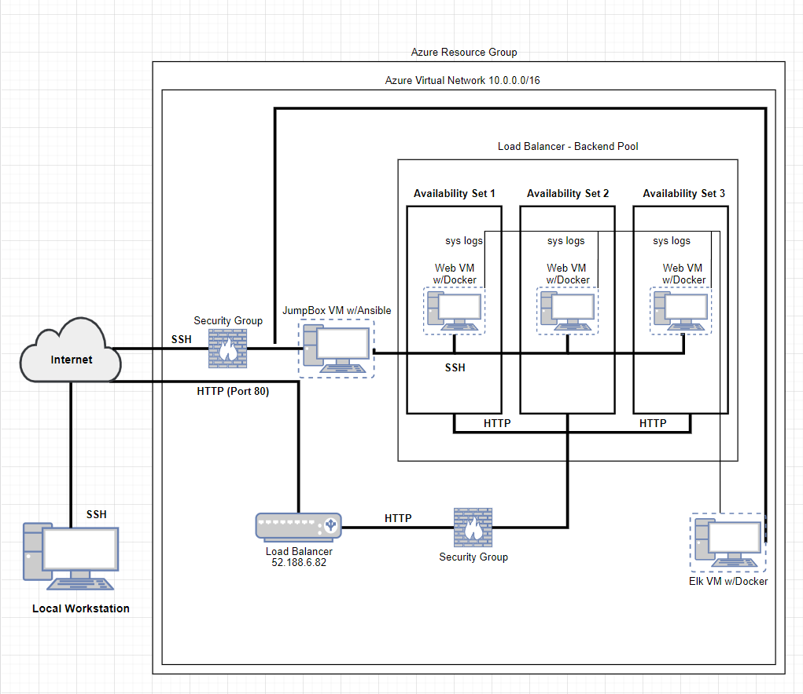
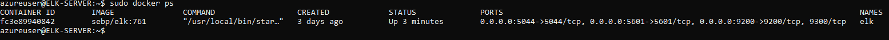

### Automated ELK Stack Deployment

The files in this repository were used to configure the network depicted below.



These files have been tested and used to generate a live ELK deployment on Azure. They can be used to either recreate the entire deployment pictured above. Alternatively, select portions of the ansible files may be used to install only certain pieces of it, such as Filebeat.

  - _elk.yml._
  - _metricbeat-playbook.yml._
  - _filebeat-playbook.yml._


This document contains the following details:
- Description of the Topology
- Access Policies
- ELK Configuration
  - Beats in Use
  - Machines Being Monitored
- How to Use the Ansible Build


### Description of the Topology

The main purpose of this network is to expose a load-balanced and monitored instance of DVWA, the D*mn Vulnerable Web Application.

Load balancing ensures that the application will be highly available, in addition to restricting traffic to the network.
- _Since load balancers can distribute incoming network traffic across multiple servers, they can add an additional layer of security against Denial of Service (DoS) attacks._
- _Utilizing a JumpBox between the web and elk vms on the network forces all traffic through a single node. Its the same concept of utilizing a gateway router, which is beneficial as it makes it easier to implement routing logic and design networks. You would only have to worry about a few connections between a few machines, rather than connections between all machines._


Integrating an ELK server allows users to easily monitor the vulnerable VMs for changes to the logs and system traffic.
- _Filebeat collects data about the file system._
- _Metricbeat collects machine metrics, such as uptime_

The configuration details of each machine may be found below.

| Name            | Function    | Availability Zone   | IP Address              | Operating System |
|-----------------|-------------|---------------------|-------------------------|------------------|
| JumpBox         | Gateway     | N/A                 | 10.0.0.4 / 23.96.99.224 | Linux            |
| Web VM w/Docker | Web Machine | Availability Zone 1 | 10.0.0.7                | Linux            |
| Web VM w/Docker | Web Machine | Availability Zone 2 | 10.0.0.8                | Linux            |
| Web VM w/Docker | Web Machine | Availability Zone 3 | 10.0.0.9                | Linux            |
| Elk VM w/Docker | Monitoring  | N/A                 | 10.1.0.4                | Linux            |

### Access Policies

The machines on the internal network are not exposed to the public Internet.

Only the JumpBox machine can accept connections from the Internet. Access to this machine is only allowed from the following IP addresses:
- _Local Workstation's Public IP_

Machines within the network can only be accessed by the JumpBox machine.
- _The ELK VM is only accessible via ssh from the JumpBox and through web access from the local workstation's public IP address._

A summary of the access policies in place can be found in the table below.

| Name            | Publicly Accessible             | Allowed IP Addresses             |
|-----------------|---------------------------------|----------------------------------|
| JumpBox         | No                              | Workstations Public IP           |
| Web VM w/Docker | Yes (Through the Load Balancer) | 52.188.6.82                      |
| Web VM w/Docker | Yes (Through the Load Balancer) | 52.188.6.82                      |
| Web VM w/Docker | Yes (Through the Load Balancer) | 52.188.6.82                      |
| Elk VM w/Docker | No                              | Workstation Public IP/JumpBox IP |

### Elk Configuration

Ansible was used to automate configuration of the ELK machine. No configuration was performed manually, which is advantageous because...
- _Ansible is a simple tool that automates complex, multi-tier IT application environments._

The playbook implements the following tasks:
- _Specify a different group of machines as well as a different remote user(in case you did not use the same admin name):_

```YAML
---
-name: Config elk VM with Docker
-hosts:elkservers
-remote_user: elk (#if you used the same admin name you do not need this step)
-become: true
-tasks:
```

- _Increase System Memory:_

```YAML
   -name: Use more memory
    sysctl:
      name: vm.max_map_count
      value: '262144'
      state: present
      reload: yes
```

- _Install docker.io, python3-pip, docker (which is the Docker Python pip module):_

```YAML
    - name: docker.io
      apt:
        update_cache: yes
        name: docker.io
        state: present

    - name: Install pip3
      apt:
        name: python3-pip
        state: present

    - name: Install Docker python module
      pip:
        name: docker
        state: present
```

- _Download and Launch the ELK container with these published ports:_

```YAML
    - name: download and launch a docker elk container
      docker_container:
        name: elk
        image: sebp/elk:761
        state: started
        restart_policy: always
        published_ports:
          - 5601:5601
          - 9200:9200
          - 5044:5044
```

The following screenshot displays the result of running `docker ps` after successfully configuring the ELK instance.



### Target Machines & Beats
This ELK server is configured to monitor the following machines:
- _Web VM w/Docker (10.0.0.7)_
- _Web VM w/Docker (10.0.0.8)_
- _Web VM w/Docker (10.0.0.9)_

We have installed the following Beats on these machines:
- _Metricbeat_
- _Filebeat_

These Beats allow us to collect the following information from each machine:
- _Metricbeat collects data from operating systems and from services running on the server. For example, Metricbeat can be used to monitor and analyze CPU and memory._
- _Filebeat collects log files from specific files, like the those generated by Apache, Microsoft Azure tools, and MySQL databases. For example, Winlogbeat collects Windows event logs._

### Installing Beats
**Before we completed the below processes its important to navigate to **http://[your.VM.IP]:5601/app/kibana**. (Replaced [your.VM.IP] with the Public IP address of the ELK server VM).

Installing Filebeat on Web VMs
- Open the ELK server homepage.
  - Click on **Add Log Data**
  - Choose **System Logs**
  - Click on the correct **OS** tab (I used DEB for Linux) under **Getting Started** to view the correct installation instructions

Installing Metricbeat on Web VMs
  - Open the ELK server homepage.
    - Click **Add Metric Data**.
    - Click **Docker Metrics**
    - Click on the correct **OS** tab (I used DEB for Linux) under **Getting Started** to view the correct installation instructions

### Using the Playbook
In order to use the Filebeat and Metricbeat playbooks, you will need to have an Ansible control node already configured. Assuming you have such a control node provisioned:

- _**Note**: You will need to run the below steps for Filebeat and Metricbeat separately. Below is an example of using the Filebeat playbook, and you can do the same thing for Metricbeat. Metricbeat configuration file can be accessed here [metricbeat-configuration.yml]()_

**Filebeat**  
SSH into the control node and follow the steps below:
- Copy the filebeat-configuration.yml file [filebeat-configuration]() to your Ansible container.
- Update the filebeat-configuration.yml file to include:

_Line #1106 is where you would edit the file by replacing the IP address with the IP address of your ELK machine_
```YAML
output.elasticsearch:
hosts: ["10.1.0.4:9200"]
username: "elastic"
password: "changeme"
```
_Line #1806 is where you would edit the file by replacing the IP address with the IP address of your ELK machine_
```YAML
setup.kibana:
host: "10.1.0.4:5601"
```
- Create a Filebeat playbook to install and launch Filebeat on the Web VMs with DVWA.
  - _When creating ansible playbooks its important to make sure the begging of the playbook is accurate as that is what indicates where and how the tasks will be executed. For Filebeat and Metricbeat playbooks, you want to makesure that you are having the beats installed on hosts: websevers which is how the playbook will know to install the beats on the websevers we want them to be on._
  - _The Filebeat playbook should look like this: [filebeat-playbook.yml]()_


- Run the playbook, and navigate to the Filebeat installation page on the ELK server GUI to check that the installation worked as expected.
  - _The ELK server GUI is accessible by navigating to **http://[your.VM.IP]:5601/app/kibana**. You replace [your.VM.IP] with the Public IP address of the ELK server that we created. If it is not working then the ELK server was created incorrectly and or configured incorrectly_
  - _To verify this, scroll down to **Step 5: Module Status** on the ELK server GUI and click **Check Data**. If you receive the below image, than the ELK stack was successfully receiving logs:_


  
