## RedTeam vs BlueTeam Project

#### Project Description

This project consisted of a Red Team vs Blue Team scenario in which I played the role of both pentester and SOC analyst. Below is a high level overview of the project as well as the steps I took to complete the project successfully.

_Red Team Role_: As the Red Team, the goal was to attack a vulnerable VM (Capstone VM) within the specific environment. The end goal is to ultimately gain root access to the machine. with the

_Blue Team Role_: As the Blue Team, the goal was to review the logs taken during the Red Team's engagement. Once the logs are reviewed, the blue team will had to interpret the data in order to suggest mitigation measures for each exploit that was performed by the Red Team.

#### Project Objectives

To complete this project I had to apply my knowledge of the following skills and tools:

  - Penetration Testing with Kali Linux
  - Log and incident analysis with Kibana
  - System hardening and configuration
  - Reporting, documentation, and communication

#### Network Topology

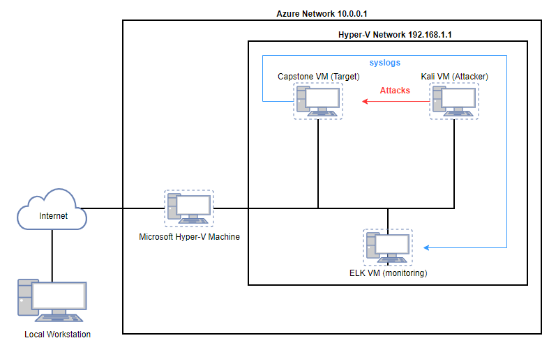

---

### Day 1: Red Team Security Assessment

#### Tools

The following tools were used during the Red Team Engagement:
  - Nmap
  - Hydra
  - Metasploit
  - Msfvenom

#### Recon: Describing the Target

The first step was to run nmap to identify the hosts on the network. After running nmap I identified the following hosts:

| Hostname      | IP Address    | Role on Network                                                                          |
| ------------- |:-------------:| -----------------------------------------------------------------------------------------|
| Hyper-V       | 192.168.1.1   | Virtualization tool used to host the capstone VM, ELK VM, and Kali VM                    |
| Capstone VM   | 192.168.1.105 | Target Machine designed to be vulnerable with http service open running Apache Web Server|
| Kali VM       | 192.168.1.90  | The attacking machine running Kali Linux                                                 |
| ELK VM        | 192.168.1.100 | The monitoring machine for the Capstone VM with filebeat, metricbeat and packetbeat      |

#### Vulnerability Assessment

The assessment uncovered the following critical vulnerabilities in the target:

| Vulnerability               | Description       | Impact  |
|-----------------------------|-------------------|---------|
| **Brute-Force Vulnerability**   |Brute-force vulnerabilities occur when login credentials can be guessed by systematically checking and attempting all possible passwords and passphrases until the correct one is found.| Brute-force vulnerabilities allow attackers to gain access to login credentials which can be used to gain persistence and access to databases with sensitive information|
| **Sensitive Data Exposure**     | Sensitive data exposure vulnerabilities occur when sensitive information is inadvertently exposed due to improper protection such as weak password hashing storage techniques or not encrypting sensitive data.| Sensitive data exposure vulnerabilities allow sensitive information to be compromised by attackers which can be used to access other areas of the network.|
| **Local File Inclusion (LFI)**    | LFI allows users to submit input files or upload files to a server. | An LFI vulnerability allows attackers to gain access to sensitive credentials or upload executable malicious code. |

#### Exploitation

The tools, processes, achievements and execution of the vulnerabilities mentioned above are outlined below.

**_Brute-Force Vulnerability Exploitation_**
  1. **Tools & Processes**
    - While traversing the public facing website on IP 192.168.1.105, I was able to find information on a password protected "secret_folder" directory through Ashtons profile within the "meet_our_team" section of the website.
    - I used the **Hydra** login cracking tool with ashton as the username and the rockou.txt file comprised of commonly used passwords.

  2. **Achievements**
    - Upon completion of the Hydra command I was able to get the username and password to access the "secret_folder".
    - Accessing the secret folder provided information on how to connect to the companies “webdav” server with login credentials for another user.

  3. **Execution**
    - The Hydra Command:
      - `hydra -l ashton -P /usr/share/wordlists/rockyou.txt -s 80 -f -vV 192.168.1.105 http-get 192.168.1.105/company_folders/secret_folder`
    - The End Result:

      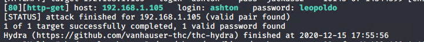

**_Sensitive Data Exposure Vulnerability Exploitation_**
  1. **Tools and Processes**
    - Once I cracked the password for the "secret_folder" there was a note about how to login with a different employee account (Ryan) with their unsalted password md5 hash.
    - From there I ran the hash through a free password hash cracking website called crackstation.net

  2. **Achievements**
    - After running the unsalted password hash, I was able to get Ryan's password for the "webdav" server.
    - This granted me access to the webdav server on the network.

  3. **Execution**
   - "seceret_folder" instructions:

      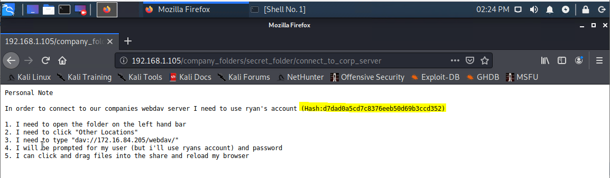

   - Crackstation.net:
      
      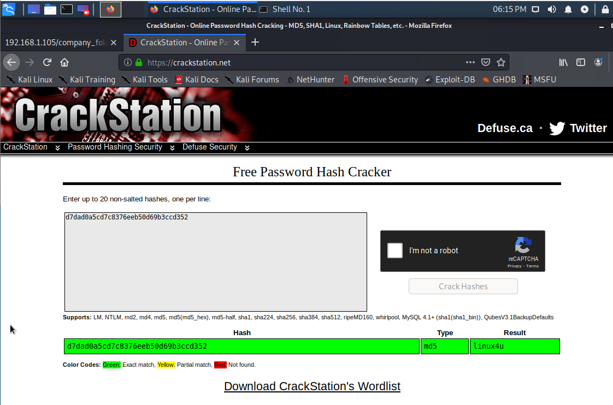

**_Local File Inclusion (LFI) Vulnerability Exploitation_**
  1. **Tools & Processes**
    - With the “webdav” access instructions and Ryan’s cracked password hash I then utilized kali linux’s file manager to connect to the webdav server on the network.
    - From there I used **msfvenom** to create a PHP reverse shell payload and uploaded it to “dav://192.168.1.105/webdav/”

  2. **Achievements**
    - I was able to create and upload a PHP reverse shell payload that would be executed through Metasploit.
    - This ultimately allowed me to establish a meterpreter session which allowed me to traverse the server until I found my intended target file.

  3. **Execution**
   - Msfvenom Command:

      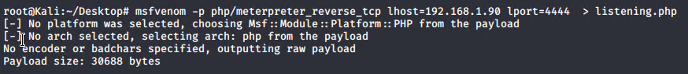

   - LFI Exploit:

      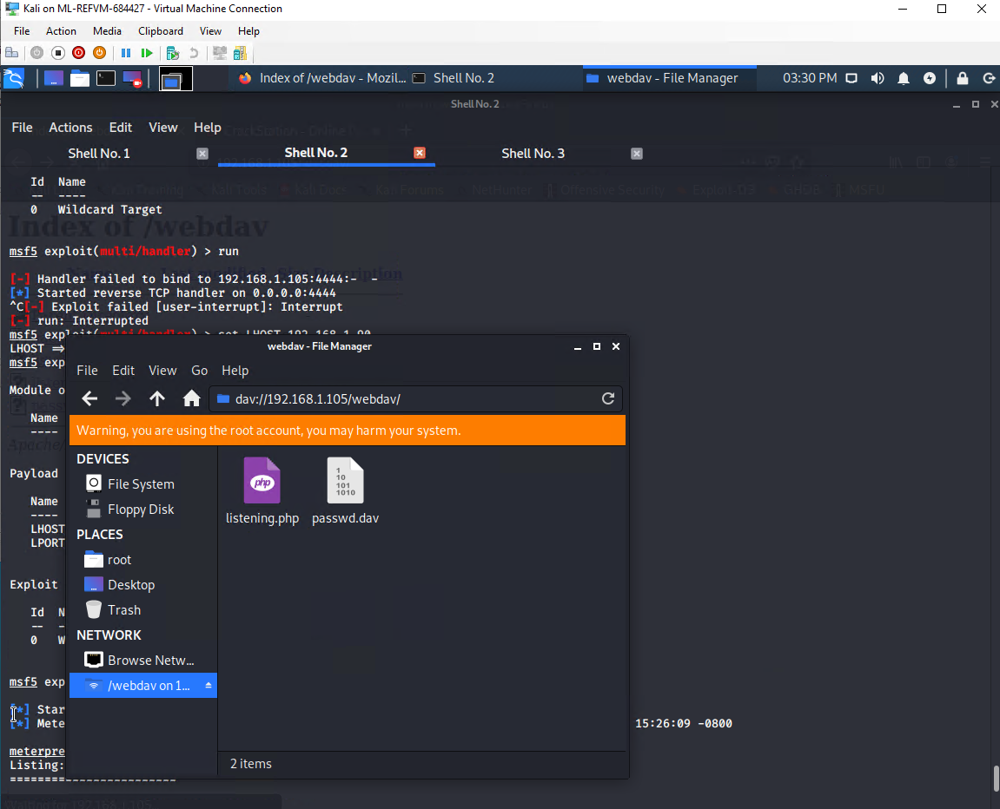

---

### Day 2: Blue Team Log Analysis and Attack Characterization

#### Tools

The following tools were used during the Blue Team Log Analysis:

  - Kibana
  - Filebeat
  - Metricbeat
  - Packetbeat

The log and metric data that was ingested into Kibana was from the following data sources:

  - Apache Logs
  - System logs
  - Apache metrics
  - System metrics

#### Analysis

**_Identifying the Port Scan_**

Through Kibana, I was able to analyze log data from Packetbeat to identify the following:
  - What time did the port scan occur?
    - The time of the port scan occured on 12-16-20 at 02:00am and 12-17-2020 at 10:00pm.
  - How many packets were sent, and from which IP?
    - I saw that in the last 5 days there were 357,176 packets sent from the following IP: 192.168.1.90.
  - What indicates that this was a port scan?
    - We can see that this is a port scan due to the spike in packets being sent to IP 192.168.1.105 and the responses sent back.

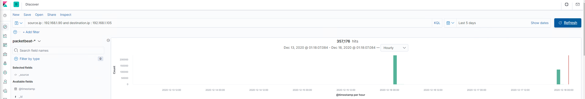
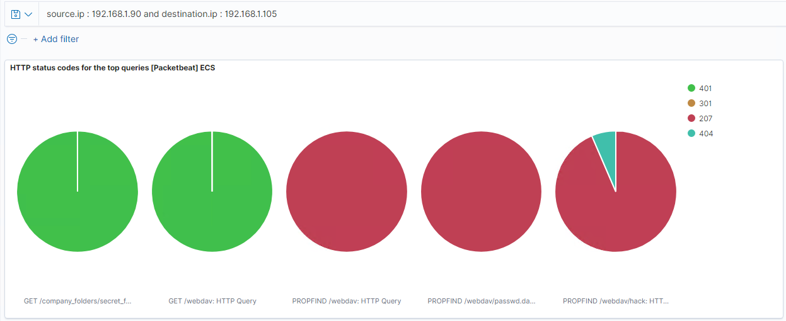
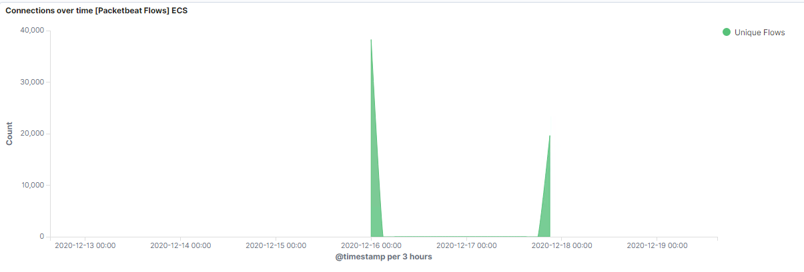

**_Finding the Request for the Hidden Directory_**

Through Kibana, I was able to analyze log data from Packetbeat to identify the following:
  - What time did the request occur? How many requests were made?
    - There were a total of 40,535 requests to the secret folder directory from the source IP: 192.168.1.90 to the destination IP: 192.168.1.105.
  - Which files were requested? What did they contain?
    - The “connect_to_corp_server” file was requested from the hidden directory which contained the directions on how to connect to the “webdav” server.

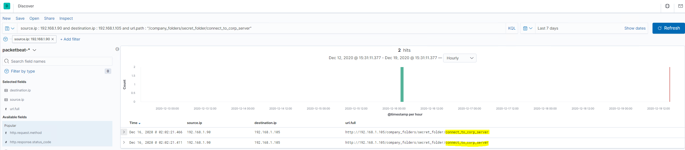

**_Uncovering the Brute Force Attack_**

Through Kibana, I was able to analyze log data from Packetbeat to identify the following:
  - How many requests were made in the attack?
    - From the Top HTTP requests [Packetbeat] ECS chart I saw that the password-protected secret_folder was requested 40,535 times and when you look at the HTTP status codes for the top queries [Packetbeat] ECS chart, 40,526 responses were 401 which indicates the attacker was unsuccessful 40,526 times.
  - How many requests had been made before the attacker discovered the password?
    - Then when I look at the search results for 200 response status codes you see that the attacker successfully accessed the password-protected "secret_folder" 6 times.

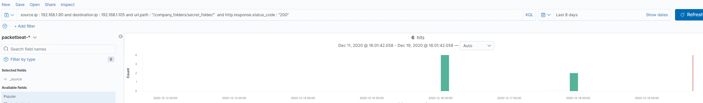

**_Finding the WebDAV Connection_**

Through Kibana, I was able to analyze log data from Packetbeat to identify the following:
  - How many requests were made to this directory and which files were requested?
    - From the Top 10 HTTP requests [Packetbeat] ECS, we see that the webdav directory had 8,715 requests and that the passwd.dav, hack and listening.php files were accessed inside this directory.

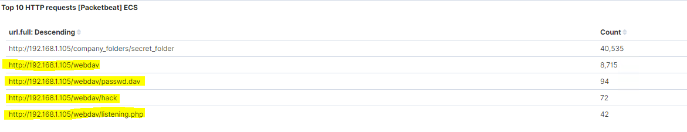

---
### Day 3: Blue Team Proposed Alarms and Mitigation Strategies

After attacking the Capstone VM and analyzing the log data, I established potential alarms and mitigation strategies.

#### Mitigation: Blocking the Port Scan

  - **Potential Alarm**
    - We can set an alarm for detecting future port scans by creating an alert that triggers for any number of ports connected to from a single origin over a period of time.
  - **Threshold**
    - We could set a threshold of 500 connections from a signal origin within an hour timeframe.
  - **System Hardening**
    - You can configure the host with firewalls and apply rules to filer the packets from a port scan so that the packet is dropped which wont send a reply.

#### Mitigation: Finding the Request for the Hidden Directory

  - **Potential Alarm**
    - We can set an alarm for detecting future unauthorized access that triggers for any machine that attempts to access the hidden directory or file within the hidden directory.
  - **Threshold**
    - We could set a threshold if the hidden directory and file is accessed more than 2 times within an hour.
  - **System Hardening**
    - We can either remove the hidden directory and file from the server all together or configure the host so that any external IP address is blocked from accessing the hidden directory and file.

#### Mitigation: Preventing Brute Force Attacks

  - **Potential Alarm**
    - We can set an alarm for detecting future brute force attacks that triggers if "401 Unauthorized" is returned from any server over a certain threshold that would weed out forgotten passwords.
  - **Threshold**
    - The threshold can be set if "401 Unauthorized" is returned 10 times in one hour and refine from there.
  - **System Hardening**
    - We can configure the host so that after the limit of 10 "401 Unauthorized" response codes have been returned from a server, that server can automatically drop traffic from the offending IP address for a period of 1 hour.

#### Mitigation: Detecting the WebDAV Connection

  - **Potential Alarm**
    - We can detect future access to the WebDAV directory by creating an alarm to trigger anytime this directory is accessed by a machine other than the machine that should have access.
  - **Threshold**
    - A threshold for this specific alarm should be set to "any connections to this directory at any given time".
  - **System Hardening**
    - The configurations that can be set on the host to control access includes:
      - Connections to this shared folder should not be accessible from the web interface.
      - Connections to this shared folder could be restricted by machine with a firewall rule.

#### Mitigation: Identifying Reverse Shell Uploads

  - **Potential Alarm**
    - We can detect future file uploads by setting an alarm that triggers when any traffic is moving over port 4444, since port 4444 is the default port used for meterpreter.
  - **Threshold**
    - The threshold for this type of alarm would be set to "any traffic at any given time"
  - **System Hardening**
    - We can remove the ability to upload files to the webdav directory over the web interface on the host to block file uploads.
